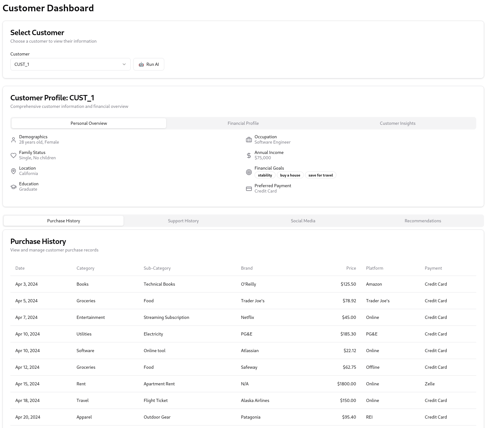
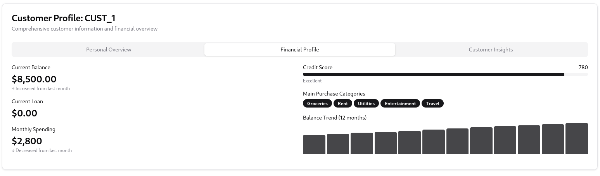
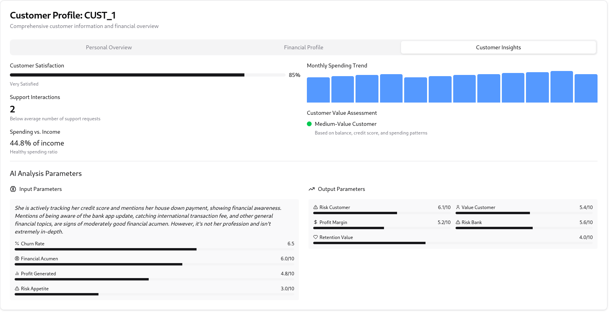
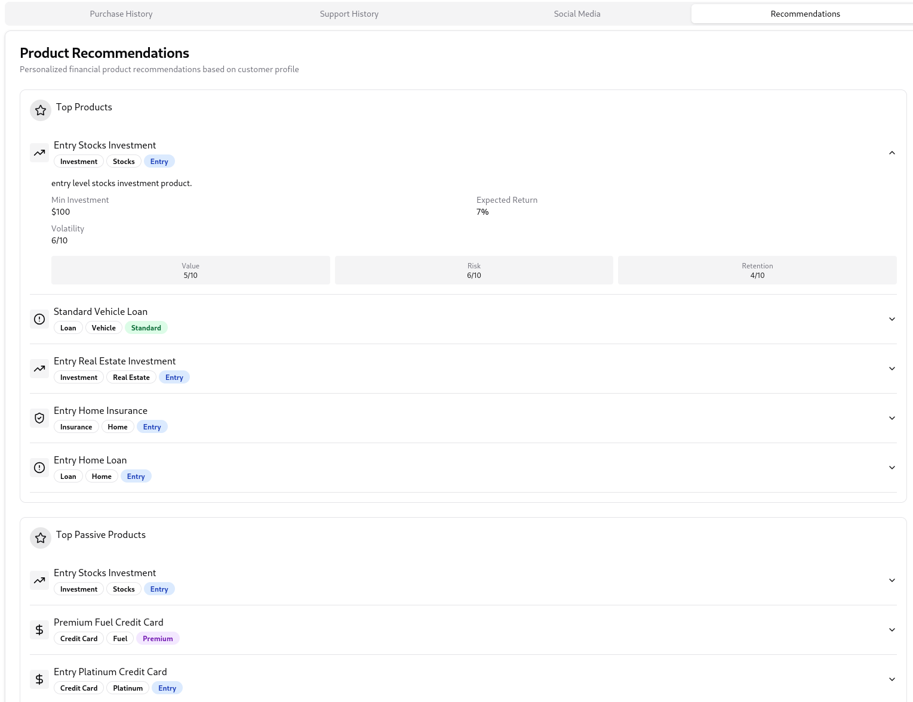
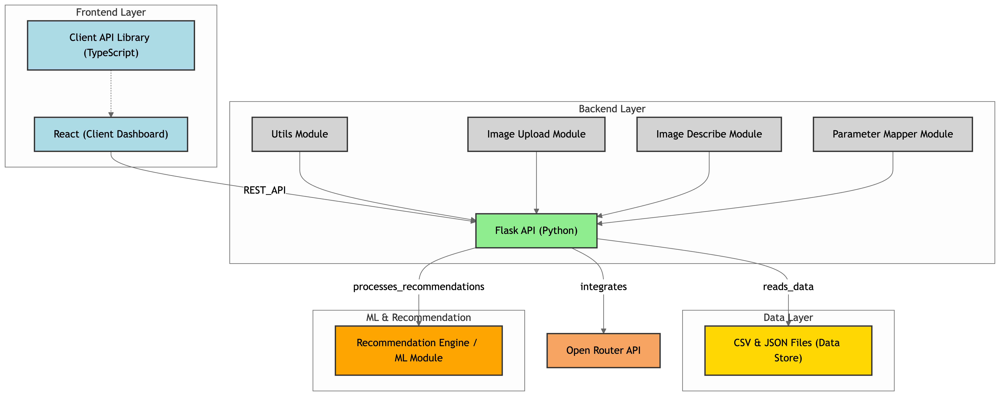

🚀 aidhip-tensor-titans

## 📌 Table of Contents

-   [Introduction](#-introduction)
-   [Demo](#-demo)
-   [Inspiration](#-inspiration)
-   [What It Does](#️-what-it-does)
-   [How We Built It](#️-how-we-built-it)
-   [Challenges We Faced](#-challenges-we-faced)
-   [How to Run](#-how-to-run)
-   [Tech Stack](#️-tech-stack)
-   [Team](#-team)

---

## 🎯 Introduction

## 🎥 Demo

📹 [Video Demo](./artifacts/demo/demo.mp4)

🖼️ Screenshots:






# Problem Statement

## AI Driven Hyper Personalization Recommendations System

### What We're Building

Imagine a banking tool that truly understands you - not just as a customer, but as an individual with unique financial goals and preferences. Our platform goes beyond one-size-fits-all recommendations by creating a personalized financial journey.

### The Smart Approach

We're developing an intuitive dashboard that does more than just suggest products. It learns your financial personality and provides:

-   Top Recommended Products: Perfectly matched to your financial profile
-   Passive Investment Options: Safe choices for when you want to balance risk

### Why It's Different

Most banking recommendations feel generic. Ours are different:

-   Tailored to your specific financial DNA
-   Balances high-potential opportunities with safe investments
-   Understands that even risk-takers need a financial safety net

### User Experience

A clean, simple interface where you can:

-   See personalized product recommendations at a glance
-   Explore both exciting and stable financial options
-   Understand why each product might be right for you

Our goal? Making complex financial decisions feel simple, personal, and empowering.

## 💡 Inspiration

Banking recommendations often feel impersonal and generic. We identified a critical gap: financial institutions struggle to provide truly personalized advice that considers a customer's unique financial personality, risk tolerance, and long-term goals.

### ⚙️ What It Does

Our platform delivers:

-   Personalized Financial Recommendations
    -   Top-tier product matching based on advanced mathematical profiling
    -   Comprehensive risk and opportunity analysis
-   Dual Recommendation Approach
    -   High-potential product recommendations
    -   Low-risk, high-retention passive investment options
-   Advanced Customer Profiling
    -   4-dimensional mathematical representation of customer financial characteristics
    -   Dynamic recommendation engine using Mahalanobis distance matching

### 🛠️ How We Built It

Technology Stack:

-   Frontend: React-based intuitive dashboard
-   Backend: Python-powered data processing
-   Machine Learning:
    -   Feature engineering
    -   Probabilistic matching algorithms
-   Data Sources:
    -   Customer banking data
    -   Social media insights
    -   Transaction histories
-   Recommendation Engine:
    -   Mahalanobis distance calculation
    -   Normalized multi-dimensional similarity scoring

### 🚧 Challenges We Faced

Technical Challenges:

-   Data Normalization: Standardizing diverse financial metrics
-   Privacy Compliance: Securing sensitive customer information
-   Model Interpretability: Creating transparent AI recommendations
-   Handling Data Sparsity: Generating insights with limited customer data

Key Mitigation Strategies:

-   Implemented robust feature scaling techniques
-   Developed explainable AI components
-   Created sophisticated data imputation methods

## 🏃 How to Run

1. Clone the repository
    ```sh
    git clone https://github.com/ewfx/aidhp-tensor-titans.git
    ```
2. Install dependencies (Need Python, Nodejs installed)
    ```sh
    pip install ./code/requirements.txt
    cd ./code/src/client
    npm install
    ```
3. Setup environement variables
    For client: Copy the `code/src/client/.env-sample` file to `code/src/client/.env`. No need to update any values.
    For backend: Copy the `code/src/.env.local` file to `code/src/.env`. Update the `code/src/.env` file with correct `Open Router` API key (Get one from [OpenRouter Api Key](https://openrouter.ai/settings/keys)).

4. Run the project
    
    Run the client
    ```sh
    cd ./code/src/client
    npm run dev
    ```

    Run the backend:
    ```sh
    cd ./code/src
    python backend.py
    ```

## 🏗️ Tech Stack

-   🔹 Frontend: React (Typescript)
-   🔹 Backend: Flask (Python)
-   🔹 Database: Currently just uses CSV files
-   🔹 Other: Open Router APIs (using `google/gemini-2.0-pro-exp-02-05:free` model)

## Architecture




## 👥 Team

- [Anurag Gupta](https://github.com/guptaanurag2106)
- [Delano Lourenco](https://github.com/3ddelano)
- [Ishan Agrawal](https://github.com/ishan0709)
- [Lokkamithran M](https://github.com/Lokkamithran)
